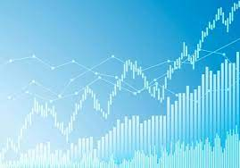

# Project module 2
---

## Status
Beta 1.1
Second project of ironhack Madrid February 2023!
Project not finished yet, several functionalities need to be improved.

## One-liner
BI Report/Dashboard to show the differences in investments over a specific time and amount invested.

## Technology stack
python                  pandas               csv
atas                    dbdiagram            Power BI
jupyter notebook

## 💥 Core technical concepts and inspiration
To compare what might be the best returns on investments over time.

## 🔧 Configuration
Download file Viz_project_m2.pbxi

## 🙈 Usage
Possible use as guidance to know which financial assets can generate better returns over time.

## 📁 Folder structure

└── project
        __trash__
        Data
            Datasets
        img
        diagram_project_m2
        functional_design_mockup
        project_m2.ipynb
        Readme
        Viz_project_m2.pbix
        Requeriments.txt

## 💩 TODO
Change name of column of return of investment.
Convert initial amount from euros to dollars.
convert final amount from dollars to euros.
Solution to dates null.
API for current datasets.
Make it more interactive.
Include statistics.
Create the tables for ideal diagram.

## ℹ️ Further info
Links:
[atas](https://www.atas.net)
[dbdiagram](https://dbdiagram.io)

References:
[pandas](https://pandas.pydata.org/docs/)
[Power BI](https://learn.microsoft.com/en-us/power-bi/)
[inflaction](https://www.inflation.eu/es/tasas-de-inflacion/espana/inflacion-historica/ipc-inflacion-espana.aspx)

## 💌 Contact info

email: juanannnnn@gmail.com

--------------------------------------------------------------------------------------------------------------------------------------------
--------------------------------------------------------------------------------------------------------------------------------------------
DISCLAIMER

Author may or may not have positions in the securities or related securities mentioned in posts. Data is provided on a best-effort basis and we make no guarantee to its accuracy.

TRADE AND INVEST AT YOUR OWN RISK. WE DO NOT OFFER INVESTMENT ADVICE.

Author is not registered with the U.S. Securities and Exchange Commission (or with the securities regulatory authority or body of any state or any other jurisdiction) as an investment adviser, broker-dealer or in any other capacity, and does not purport to provide investment advice or make investment recommendations by or through the Content found on the Site or otherwise. The Site and the Content are provided for the sole purpose of enabling you to conduct investment research. Other uses of the Site and the Content are expressly prohibited.

Futures and forex trading contains substantial risk and is not for every investor. An investor could potentially lose all or more than the initial investment. Risk capital is money that can be lost without jeopardizing ones’ financial security or life style. Only risk capital should be used for trading and only those with sufficient risk capital should consider trading. Past performance is not necessarily indicative of future results.

Hypothetical performance results have many inherent limitations, some of which are described below. No representation is being made that any account will or is likely to achieve profits or losses similar to those shown; in fact, there are frequently sharp differences between hypothetical performance results and the actual results subsequently achieved by any particular trading program. One of the limitations of hypothetical performance results is that they are generally prepared with the benefit of hindsight. In addition, hypothetical trading does not involve financial risk, and no hypothetical trading record can completely account for the impact of financial risk of actual trading. for example, the ability to withstand losses or to adhere to a particular trading program in spite of trading losses are material points which can also adversely affect actual trading results. There are numerous other factors related to the markets in general or to the implementation of any specific trading program which cannot be fully accounted for in the preparation of hypothetical performance results and all which can adversely affect trading results.
